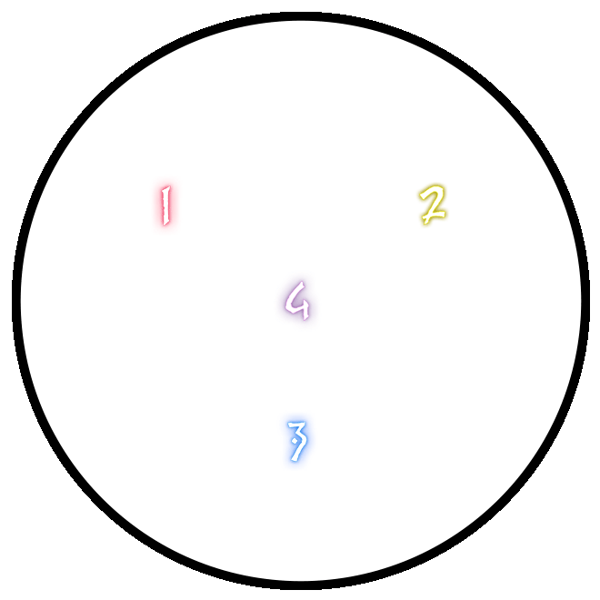




# The Unending Coil of Bahamut

MUR Strats 
{: .label .label-purple }

This guide is based of the original and very detailed guide by Clees, which can be found below:

[Clees Guide](https://clees.me/guides/ucob/){: .btn .btn-purple }

### Credits
Written Guide by Em'gram
PoVs by Kur Rumi

### PoVs

[DPS](https://www.youtube.com/watch?v=nYFW4YKTk-8){: .btn }
[Healer](https://www.youtube.com/watch?v=wfVuqFvT0AE){: .btn }
[Tank](https://www.youtube.com/watch?v=4R_b3AauWGk){: .btn }

### Macros

<details markdown=1>
<summary>View All Macros</summary>

**Macro 1**

Neurolinks and Nael Spreads
```
==========================================
[Neurolink placement]
■ - 1>2>3
[Nael spread]
         MT    ST
               ♦
        D1      D2
D3  H1      H2  D4
```

**Macro 2**

QMT and BFT
```
[Quickmarch]
MT     Trio   ST
H1                H2
D1                D2
D3                D4
             DPS Shaker
H1/MT   Baha   H2/ST
                STACK
(relative to trio spawn)
[Blackfire]
MT     Nael    D1
ST                    D2
H1                   D3
H2    STACK   D4
```

**Macro 3**

FRT and HFT
```
[Fellruin]
■ - Bahamut - MT
■ - Twin - ST
■ - Nael - Party
     MT    ST
D1    H1   D2
D3    H2   D4
(H1 stays on neurolink)
[Heavensfall]
        MTST
H1                 H2
D1                 D2
        D3D4
*ST Covers Nael Tower
ST +1 | H2 +2 | D2 +3 | D4 +4 | MT -1 | H1 -2 | D1 -3 | D3 -4
```

**Macro 4**

TST and GO
```
[Tenstrike]
■ - Left > Right Generate Priority
             TRUE NORTH
D3 D1 H1 MT ST H2 D2 D4
■ - If the line-up is wrong, spread to your Quickmarch sides and adjust accordingly
             Earthshakers
                   NW  NE
              W                  E
■ - South is the safe spot for both sets of Earthshakers
[Grand Octet]
■ - Twin bait - Left of twin (from middle facing twin)
■ - Megaflare stack - Right of twin (from middle facing twin)
■ - Tank LB3 can be used here for safety
```

**Macro 5 (D4 Float)**

Adds
```
[Adds Phase]
■ - MT = Start Twin
■ - ST = Start Nael
Neurolink Priority:
■ - D1 - Waymark 1 Neurolink
■ - D2 - Waymark 2 Neurolink
■ - D3 - Waymark 3 Neurolink
■ - D4 - Float
```

**Macro 6**

Golden Bahamut Mits
```
[Morn Afah Mitigation]
■ - Use the transition to clarify and adjust any mitigations
■ - 1 - MT 90, ST Reprisal, Addle, rDPS Mit
■ - 2 - ST 90, MT Reprisal, any spare Mit, Tank LB
■ - 3 - MT 90, ST Reprisal, Addle
■ - 4 - ST 90, MT Reprisal, rDPS Mit, Tank LB
■ - 5 - MT 90, ST Reprisal, Addle
[Akh Morn Mitigation]
■ - 1 - Share
■ - 2 - WAR > GNB > PLD > DRK Invuln priority
■ - 3 - The other tank
■ - 4 - Share (with tank LB if mitigation is lacking)
==========================================
```

</details>

## Phase 1: Twintania

### Key Mechanics

{: .everyone }
> Look out for  cast, you will need to be moving when it finishes otherwise you will die and kill anyone near you. Start moving at 90% and spread out to make sure you have somewhere safe to run.
>
>  will target a player with a party stack, Generate more LB by having one player stay out of the first  stack at the start of this phase.

{: .tanks }
>  is a forced tank swap. Communicate an order with your Co-tank.
>
> Your role is to position the boss in a way to drop a  on each of the 1,2,3 markers in order. This will happen when the boss hits 74%, 44% and 0%. You should be on the outside of the boss towards the wall unless moving in to stack with party for other mechanics.
>
> 

{: .damage }
> You will have two roles in this phase, firstly **Ranged** will need to bait  by being the furthest player from the boss through the phase. Assign a **Primary Baiter** and **Backup Baiter**.
>
> All DPS can get targetted by  orbs, run to a  and make sure you are in the  when the  orb reaches you. 
>
> If you are **Primary Baiter** and you get hatch, make sure the other baiter is aware they need to take .

{: .healers }
> Just stay outta the way lol.

### Phase Timeline

<details markdown=1>
<summary>Expand Phase Timeline</summary>

### 100% -> 74% Mini-Phase
1. Pull Twintania to waymark 1.
1.  on Tanks.
1.  Dodge.
1.  Stack.
1.  Tank Swap.
1. Push to 74% and drop .

### 74% -> 44% Mini-Phase
1. Move boss to next marker.
1.  on furthest player.
1.  to .
1.  Tank Swap.
1.  to .
1.  Dodge.
1. Push to 44% and drop .

### 44% -> 0% Mini-Phase
1. Move boss to next marker.
1.  on furthest player.
1.  **x2** to .
1.  on **RANDOM** party member.
1.  Stack.
1.  Tank Swap.
1.  **x2** to .
1.  Dodge.
1.  on furthest player.
1.  **x2** to .
1.  on **RANDOM** party member.
1.  Stack.
1. Push to 0%.

Finally, Stand in a  for phase transition.

{: .note }
> If you don't phase any of these checkpoints in time, Twintania will continue to repeat the mechanics of the current Mini-Phase until you hit the next phase or enrage.

</details>

## Phase 2: Nael

### Key Mechanics

{: .everyone }
>  Two players are targeted with the  debuff and need to stay away from the party to avoid killing party members or giving them paralysis.
> 
>  Large white puddles appear on the ground exploding shortly after, lethal damage if you are in the puddle when it explodes. It leaves behind a small white puddle after the explosion which can remove doom.
> 
>  Inflicted to multiple players, will kill the player when the timer reaches zero. You can remove this by stepping in the light-puddle left behind by Wings of Salvation.

{: .tanks }
>  Nael jumps onto her target, dealing significant splash damage. Make sure to spread away from the tank to prevent any extra damage.
> 
>  Physical tankbuster consisting of 5 successive hits to her target.
> 
> Nael enters with  on **Tank with last aggro on Twintania**, followed by . Use an Invuln here and keep this away from party.

### Icebitten and Firescorched

Through the phase, dragons will attack players with iceballs and AOE other players with a fire tether, each applies a debuff or removes the opposite debuff. If you have either debuff and you are hit by the same effect again (ie: hit by fireball and you already have firescorched ) you will die.

To safely manage this, you will stack together for Fire tethers, to remove the ice debuffs from the party. There will be **FOUR** fire tethers during the phase and they should be stacked or taken out of the group using the following order;

**IN > OUT > IN > IN**

This means the first tether is stacked, the second tether is taken out of the party, and the third and fourth fire tether are also stacked with the party. It is each members responsibility to monitor their debuffs and ensure they are in the fire stacks in time.

The second fire tether is usually taken out to the LEFT of the party stack location.


{: .important }
Whoever gets the second fire tether and takes it out of the party must AVOID the third fire tether as they will already have the fire debuff and this will kill them if they join the stack.

### Quotes

Through the phase Nael will say various quotes, these are indicators for upcoming mechanics, if you cannot translate the quotes then you will die to the mechanics. Each quote translates to a pair of mechanics in this phase. 

- O hallowed moon, take fire and scorch my foes! =  → 
- O hallowed moon, shine you the iron path! =  → 
- Blazing path, lead me to iron rule! =  → 
- Take fire, O hallowed moon! =  → 
- From on high I descend, the iron path to call! or From on high I descend, the iron path to walk! =  → 
- From on high I descend, the hallowed moon to call! =  → 
- Fleeting light! 'Neath the red moon, scorch you the earth! =  → 
- Fleeting light! Amid a rain of stars, exalt you the red moon! =  → 

Quotes come in pairs, either one of the two can happen and you need to be able to read the quote to identify them. It is easier to remember them when you break them down to pairs of two possible mechanics.

Quote 1:
- IN → STACK
- IN → SPREAD

Quote 2:
- STACK → IN
- STACK → OUT

Quote 3: 
- SPREAD → IN
- SPREAD → OUT

QUOTE 4:
- TANKBUSTER DIVE → STACK
- SPREAD → TANKBUSTER DIVE

*Don't tell yoshi-p but there are some good tools to help quickly translate quotes to more understandable mechanics...*

### Phase Overview

The fight starts and a pillar will drop in the room, spread out for Meteor Stream and dodge the cleaves.

Boss will enter on a tank and the party will stack up behind the boss ready for the first quotes. Two players will get .

Quotes 1: 
- O hallowed moon, take fire and scorch my foes! (IN → STACK)
- O hallowed moon, shine you the iron path! (IN → SPREAD)

The two players with  must seperate from the party and take up a position near the boss opposite the party. Thunderstruck will resolve before the second mechanic in the quote.


## Phase 3: Bahamut
Coming Soon

## Phase 4: Adds
Coming Soon

## Phase 5: Golden Bahamut
Coming Soon
